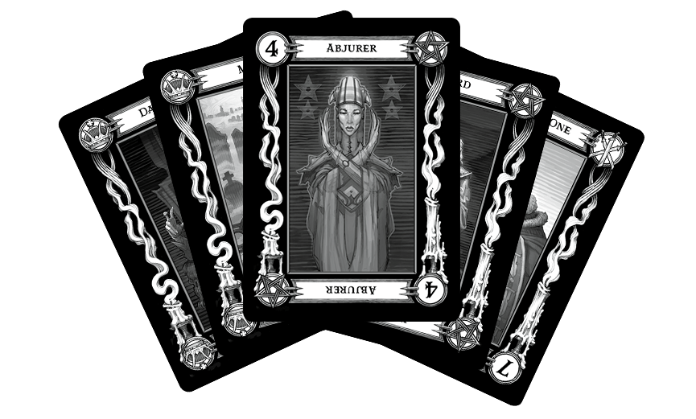

## Feldnotiz des [Balthasar Buddelsam](../NPCs/Balthasar%20Buddelsam.md)

Die merkwürdige Dame, die sich im Kampf als eine Verbündete bewiesen hatte, benebelte ihre Sinne mit einem nicht überprüften Rauschmittel unbekannter Abstammung. In einen tranceähnlichen Zustand versetzt legte sie vor unserer Gruppe fünf Karten auf den Boden. Keine Spielkarten, sondern mit mysteriösen Bildern versehene schwarze Karten, welche sie in einem mit Seide ausgekleideten Holzkästchen aufbewahrt hatte.

Karte um Karte wurde von ihr aufgedeckt und sie murmelte dabei unbeirrt vor sich hin. Ihre Stimme klang wie von einer fremden Macht gesteuert und als wäre sie nicht bei Verstand. Die Worte ergaben für mich keinen Sinn, doch ich hielt sie fest - sie könnten sich möglicherweise noch von Wichtigkeit erweisen.

### Erste Karte

Die erste Karte erzählt eine Geschichte.

Das Wissen über den Uralten macht es euch leichter, euren Feind zu verstehen.

**Die Rächerin:** Der Schatz liegt im Hause des Drachen, einstmal reinen Händen, die heute befleckt.

### Zweite Karte

Die zweite Karte berichtet von einer großen Macht zum Schutz des Guten, ein heiliges Symbol der Hoffnung.

**Der Verräter:** Sucht eine wohlhabende Dame. Mit den Knochen eines uralten Feindes hält die loyale Verbündete des Bösen den Schatz hinter Schloss und Riegel.

Geht es um [Fiona Wachter](../NPCs/Fiona%20Wachter.md)? Wir haben [ein magisches Amulett](ein%20magisches%20Amulett.md) gefunden in ihrem Haus

### Dritte Karte

Die dritte Karte berichtet von Macht und Stärke. Sie kündet von einer Waffe der Rache: Eine [Klinge aus Sonnenlicht](Schwert%20der%20Sonne.md).

**Die Soldatin:** Suche in den Bergen. Erklimme den weißen Turm, von goldenen Rittern bewacht.

[Festung Argynvostholt](../Places/D%C3%B6rfer/Festung%20Argynvostholt.md)? Oder [Bernsteintempel](../Places/Geb%C3%A4ude/Bernsteintempel.md)

### Vierte Karte

Diese Karte enthüllt jenen, der euch eine große Hilfe in der Schlacht gegen die Finsternis sein wird.

**Der Henker:** Suche den Bruder der Braut des Bösen.

Euer Feind ist eine Kreatur der Finsternis, deren Macht jenseits von Leben und Tod liegt.

- Ist die Braut [Irina Kolyana](../NPCs/Irina%20Kolyana.md)? Dann wäre ihr Bruder [Ismark Kol­yanovich](../NPCs/Ismark%20Kol%C2%ADyanovich.md)
- Könnte aber auch [Kasimir Velikov](../NPCs/Kasimir%20Velikov.md) sein. Seine Schwester [Patrina](../NPCs/Patrina.md) wollte fast [Strahd](../NPCs/Strahd%20von%20Zarovich.md) heiraten. 

### Fünfte Karte

Diese letzte Karte wird euch zu ihm führen!

**Die Unschuldige:** Er verweilt bei jenem, dessen Blut sein Schicksal besiegelte, ein Bruder, dessen Licht zu früh erlosch.

Geht es um [Sergej](../NPCs/Sergej.md)?

